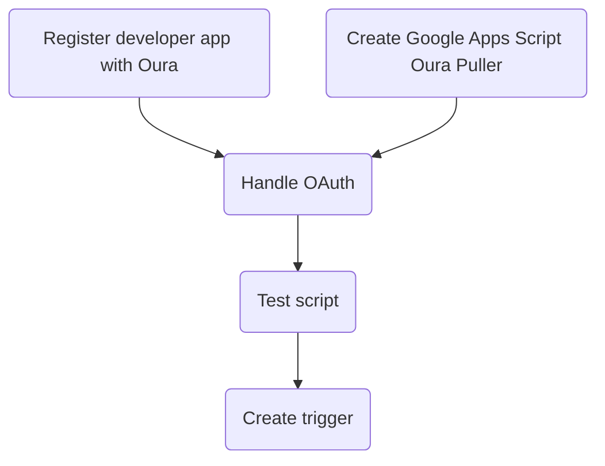

# Overview

If you own an Oura Ring, it is nice to pull those data into your Data Journal.

After a one-time setup procedure your **Oura ring data** can be copied into your journal **automatically**.

![[Oura Data Puller Setup 2026-04-03 15.01.55.excalidraw.svg]]

%%[[Oura Data Puller Setup 2026-04-03 15.01.55.excalidraw.md|🖋 Edit in Excalidraw]]%%

# Details

> [!warning]
> This is a bit more technical & involved, but **it's worth it**.

## Why Pull Oura Data In?

Oura is an **excellent** source of a wide variety of data about your behavior. 

While it's true the Oura app and Oura cloud provide great analytics features, it's not trivial to analyze your Oura data *in the context of the **rest** of your Data Journal data*. 

I'm my [[Master's in Data Analytics]] capstone project - I found the **single best correlation to daily satisfaction** was `active calories` from my Oura ring data.

- [ ] #todo - picture here
## Process Overview

... #todo