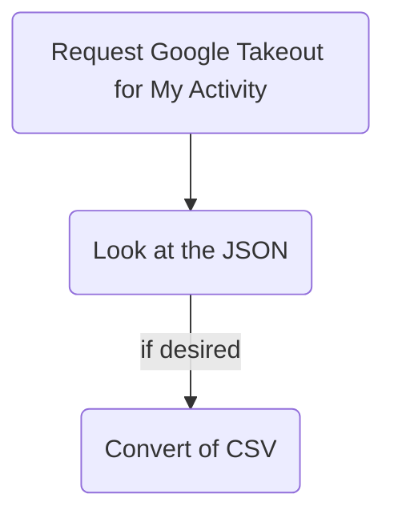

# Overview

If you're signed into Google when you watch YouTube videos, they've got a history of everything you've ever searched, watched, or listened to.

You can extract this file and find some neat stuff in it. 

I created this moderately depressing chart & found out who my top 10[^1] YouTube channels are.

![[youtube_views_by_year.png]]

# Details

## Why Track YouTube?

If you're signed into Google when you watch YouTube, then they record of everything you've watched, searched for, and listened to is available to you.

Tracking YouTube data can reveal:

- Just how much YouTube *do* you watch?
- When do you typically watch videos during the day?
- Which creators are you giving your time to?

## Process Overview



## How to, Briefly

> [!warning] FYI
> - This guide doesn't teach you how to run a Python file. If you're interested in doing this and don't know how to do that, follow this guide with your favorite AI tool for help.
> - This is accurate as of 2026-03-31. They change things like this a lot, though. Also right now this assumes iPhone and Macs. The process for Android & Windows would be very similar, though.

3. Open [Google Takeout](https://takeout.google.com)
4. Click **Deselect all** to untick all the checkboxes
5. Scroll down and tick the box on ==**My Activity**==
	1. → ⚠️ NOTE: **NOT** the "YouTube and YouTube Music" at the bottom
	![[my_activity_google_takeout.png]]
6. Click on `All activity data included`
7. Click **Deselect all** to untick all the checkboxes
8. Tick the box next to `YouTube`
9. Click the `Multiple formats` button
10. Change `HTML` to `JSON`
    ![[my_activity_json_switch.png]]
11. Click `OK`
12. At the bottom of the page, click `Next step`
13. At the bottom of the page, click `Create export`
14. Wait for an email from Google with the file
15. When you get the email, open the link & download the `.zip`
16. Extract `MyActivity.json` 
17. If you like, open the file as-is and poke around
	1. JSON can open in any text editing program - VS Code, TextEdit, etc
	2. If you're not familiar with JSON, this whole process maybe isn't for you, but if you're brave keep going to get the `csv`
18. Create a Python file (`coverter.py`)in the same folder, containing the code below
19. Run the Python file in VS Code or with a terminal and the command:

```terminal
python3 converter.py
```

From there you should have a new file in that same folder titled `youtube_watch_history.csv`. Open it and see what you can see!
## Python

```python
# Contents of converter.py
# Converts YouTube History JSON exports to CSV
# Intentionally filters out YouTube Music plays
# & YouTube searches.

import json
import csv
from datetime import datetime

# Configuration
input_file = 'MyActivity.json'
output_file = 'youtube_watch_history.csv'

def clean_title(title):
    """Removes 'Watched ' or 'Viewed ' prefixes from the title string."""
    for prefix in ["Watched ", "Viewed "]:
        if title.startswith(prefix):
            return title[len(prefix):]
    return title

def transform_data():
    try:
        with open(input_file, 'r', encoding='utf-8') as f:
            data = json.load(f)
    except FileNotFoundError:
        print(f"Error: {input_file} not found.")
        return

    cleaned_data = []

    for entry in data:
        # 1. Skip YouTube Music
        if entry.get('header') == 'YouTube Music':
            continue
        
        # 2. Skip entries without subtitles (Filters out Searches)
        subtitles = entry.get('subtitles', [])
        if not subtitles:
            continue
            
        # 3. Extract and Clean Data
        channel_name = subtitles[0].get('name')
        raw_title = entry.get('title', '')
        title = clean_title(raw_title)
        time_str = entry.get('time', '')

        # Standardizing the time format for easier analysis
        try:
            # Format usually looks like: 2026-03-29T14:43:47.595Z
            dt = datetime.strptime(time_str.split('.')[0], "%Y-%m-%dT%H:%M:%S")
            formatted_time = dt.strftime("%Y-%m-%d %H:%M:%S")
        except Exception:
            formatted_time = time_str # Fallback

        cleaned_data.append({
            'time': formatted_time,
            'title': title,
            'channel': channel_name
        })

    # Write to CSV
    keys = ['time', 'title', 'channel']
    with open(output_file, 'w', newline='', encoding='utf-8') as f:
        dict_writer = csv.DictWriter(f, fieldnames=keys)
        dict_writer.writeheader()
        dict_writer.writerows(cleaned_data)

    print(f"Done! Extracted {len(cleaned_data)} video views to {output_file}")

if __name__ == "__main__":
    transform_data()
```

[^1]: 10,000, actually
