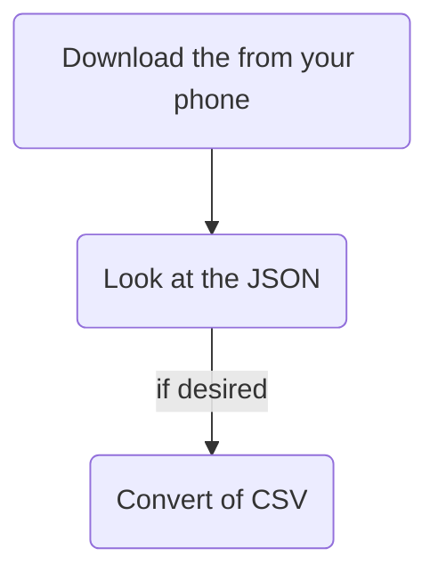

# Overview

If you've Google Maps on your phone, chances are you've also got a Google Timeline file.

You can extract this file and find some neat stuff in it. 

I created this very uplifting chart showing my time spent in vehicles and spent walking year-over-year with this method. 

![[timeline_chart.png]]

# Details

Google Timeline is a feature Google offers wherein you can go **back in time** for your **location history** in your life. Not only a day-by-day location history, but a minute-by-minute one, including GPS details **and** some surprises like what mode of transport you are likely using.

If you've an iPhone and you've not told Google Maps it cannot use your location, you have this data.  
If you've got an Android phone, you almost certainly have this. 



> [!tip] EXPORT THIS BEFORE CHANGING PHONES
> Google's made some changes within the past few years. If you change phones, your location history goes away when your old phone goes away.

## How to, Briefly

> [!warning] FYI
> - This guide doesn't teach you how to run a Python file. If you're interested in doing this and don't know how to do that, follow this guide with your favorite AI tool for help.
> - This is accurate as of 2026-03-31. They change things like this a lot, though. Also right now this assumes iPhone and Macs. The process for Android & Windows would be very similar, though.

1. **On your phone** open Google Maps
2. Tap your face in the top-right corner
3. Tap `Your Timeline`
4. Tap the 3-dot menu in the top-right corner
5. Tap `Location & privacy settings`
6. Tap `Export Timeline data`
7. The get the `location-history.json` file to your computer
	1. On iPhone: From the share sheet, email it to yourself or AirDrop it
8. **On your computer** save the file you just sent yourself to a folder
9. If you like, open the file as-is and poke around
	1. JSON can open in any text editing program - VS Code, TextEdit, etc
	2. If you're not familiar with JSON, this whole process maybe isn't for you, but if you're brave keep going to get the `csv`
10. Create a Python file (`coverter.py`)in the same folder, containing the code below
11. Run the Python file in VS Code or with a terminal and the command:

```terminal
python3 converter.py
```

From there you should have a new file in that same folder titled `location_log.csv`. Open it and see what you can see!
## Python

```python
# Contents of converter.py
# Converts Google Timeline JSON exports to CSV
# May lose some data in the process - the JSON 
# doesn't natively collapse to a table neatly.

import json
import csv
from datetime import datetime

input_file = 'location-history.json'
output_file = 'location_log.csv'

def transform_timeline():
    try:
        with open(input_file, 'r', encoding='utf-8') as f:
            data = json.load(f)
    except FileNotFoundError:
        print(f"Error: {input_file} not found.")
        return

    cleaned_rows = []

    for entry in data:
        row = {
            'start_time': entry.get('startTime', ''),
            'end_time': entry.get('endTime', ''),
            'type': 'UNKNOWN',
            'detail': '',
            'distance_meters': 0
        }

        # Case 1: Activity Segment (Walking, Driving, etc.)
        if 'activity' in entry:
            activity_data = entry['activity']
            row['type'] = 'ACTIVITY'
            row['detail'] = activity_data.get('topCandidate', {}).get('type', 'unknown')
            row['distance_meters'] = activity_data.get('distanceMeters', 0)

        # Case 2: Timeline Path (Raw GPS Breadcrumbs)
        elif 'timelinePath' in entry:
            path = entry['timelinePath']
            row['type'] = 'PATH'
            # Count the points to show density of the data
            row['detail'] = f"{len(path)} GPS points"
            
        # Case 3: Place Visit (If present in your file)
        elif 'placeVisit' in entry:
            visit = entry['placeVisit']
            row['type'] = 'STAY'
            row['detail'] = visit.get('location', {}).get('name', 'Unknown Place')

        # Clean up the timestamp for readability (stripping the T and Z)
        # Example: 2026-03-29T21:00:00.000Z -> 2026-03-29 21:00:00
        if row['start_time']:
            row['start_time'] = row['start_time'].replace('T', ' ').split('.')[0]

        cleaned_rows.append(row)

    # Write to CSV
    keys = ['start_time', 'end_time', 'type', 'detail', 'distance_meters']
    with open(output_file, 'w', newline='', encoding='utf-8') as f:
        writer = csv.DictWriter(f, fieldnames=keys)
        writer.writeheader()
        writer.writerows(cleaned_rows)

    print(f"Success! Processed {len(cleaned_rows)} timeline segments into {output_file}")

if __name__ == "__main__":
    transform_timeline()
```
