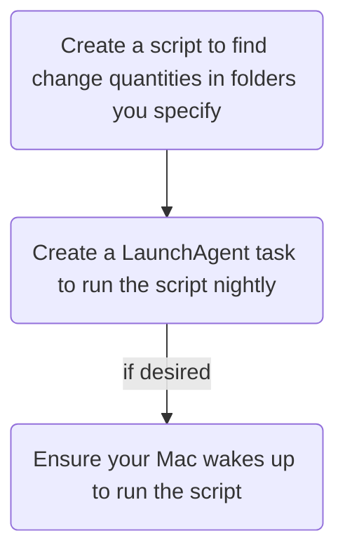

# Overview

You can set up automations to gather and report the volume of changes to files in specific directories (& sub-directories) on your computer. 

This can be used to track notes created and/or edited **Obsidian** vaults.

![[Obsidian and File Tracking 2026-04-04 14.23.46.excalidraw.svg]]
%%[[Obsidian and File Tracking 2026-04-04 14.23.46.excalidraw.md|🖋 Edit in Excalidraw]]%%
# Details

If you use Obsidian, you can use a **shell script** to...

Within a given (set of) directory(ies):

1. Find all files **created** since yesterday
2. Find all files **edited** since yesterday
3. Count the above or list their names
4. Send those data to your Data Journal

> [!warning] 
> This is a bit technical.  
> Also only tested on MacOS.

## Process Overview


# How to

## 1. The Scripts

Create a folder at `~/Developer/scripts/` to house your automation.

### **The Wrapper Script** (`run_sync_and_task.sh`)

This script acts as a buffer, giving the Mac time to connect to Wi-Fi and sync iCloud before the main task starts.

Bash

```shell
#!/bin/bash
# Path to your main script
MAIN_SCRIPT_PATH="/Users/YOUR_USERNAME/Developer/scripts/my_nightly_task.sh"
# Wait 5 minutes for iCloud sync
sleep 300
# Execute the Main Script
/bin/bash "$MAIN_SCRIPT_PATH"
exit 0
```

### **The Main Task Script** (`my_nightly_task.sh`)

This contains the actual logic you want to run.

I suggest starting with the [[#Simple Starter Sanity Check Script]] to test the automation first, then move onto the [[#Actual Data Journal Writer Script]]. 

**Crucial:** Make all scripts *executable* via Terminal (grant them permissions, essentially):

Bash

```shell
chmod +x ~/Developer/scripts/*.sh
```

#### Simple Starter Sanity Check Script

You can use this in place of the full script to simply test the automation. It will write a simple text file to your desktop. If you see this file appear, then you're good to replace it with the logic that actually writes to the Data Journal Web App.

Bash

```shell
#!/bin/bash
# Example: Log completion to the desktop
echo "Task ran at $(date)" >> "$HOME/Desktop/nightly_log.txt"
exit 0
```

#### Actual Data Journal Writer Script

This assumes you're using the [[meta/OLD-Reference Build/OLD-The Reference Build - a Complete Data Journal Architecture|Reference Build]] web app. You'd still need to tweak the paths you're watching & your web app url:

Bash

```shell
columns=()

columns+=("$(find "/Users/aaron/Library/Mobile Documents/iCloud~md~obsidian/Documents/Notes" \
-name "*.md" -maxdepth 1 -type f \
-exec stat -f "%SB" -t "%Y-%m-%d" {} \; | grep "$(date +%Y-%m-%d)" | wc -l)")

columns+=("$(find \
"/Users/aaron/Library/Mobile Documents/iCloud~md~obsidian/Documents/Notes" \
"/Users/aaron/Library/Mobile Documents/iCloud~md~obsidian/Documents/Notes/sources" \
-type f -name "*.md" -maxdepth 1 \
-newermt "$(date -v0H -v0M -v0S)" | wc -l)")

column_string=$(IFS=,; echo "${columns[*]}")

json_payload=$(printf '{"sheet":"PRODUCTIVITY","columns":[%s]}' "$column_string")

echo "Wrote: $json_payload"

curl -L -X POST https://script.google.com/macros/s/YOURWEBAPPLONGSTRINGHERE/exec \
  -H "Content-Type: application/json" \
  -d "$json_payload"
  
echo "Task ran at $(date). Saved ${json_payload}" >> "$HOME/Desktop/nightly_log.txt"
```

---

## 2. The LaunchAgent Configuration

Create a file named `com.user.nightlytask.plist` in `/Users/YOUR_USERNAME/Library/LaunchAgents/`.

**Note:** Replace `YOUR_USERNAME` with your actual macOS shortname (e.g., `aaron`). Do **not** use `~`.

XML

```
<?xml version="1.0" encoding="UTF-8"?>
<!DOCTYPE plist PUBLIC "-//Apple//DTD PLIST 1.0//EN" "http://www.apple.com/DTDs/PropertyList-1.0.dtd">
<plist version="1.0">
<dict>
    <key>Label</key>
    <string>com.user.nightlytask</string>
    <key>ProgramArguments</key>
    <array>
        <string>/bin/bash</string>
        <string>/Users/YOUR_USERNAME/Developer/scripts/run_sync_and_task.sh</string>
    </array>
    <key>StartCalendarInterval</key>
    <dict>
        <key>Hour</key>
        <integer>23</integer>
        <key>Minute</key>
        <integer>50</integer>
    </dict>
</dict>
</plist>
```

---

## 3. Deployment Commands

Run these commands in order to establish the hardware wake schedule and load the software instructions.

### **Step A: Schedule Hardware Wake**

`launchd` cannot wake a "deep sleeping" Mac on its own. Use `pmset` to tell the hardware to wake up one minute before the script is due.

Bash

```
sudo pmset repeat wakeorpoweron MTWRFSU 23:49:00
```

### **Step B: Load the Instruction Manual**

Tell macOS to add your `.plist` to the system's background manager.

Bash

```
launchctl bootstrap gui/$(id -u) ~/Library/LaunchAgents/com.user.nightlytask.plist
```

### **Step C: Verify the Setup**

Check if the job is successfully loaded:

Bash

```
launchctl list | grep nightly
```

_A successful load will show a line like `- 0 com.user.nightlytask`._

---

## 🛠 Summary of Operation

1. **23:49:** The Mac hardware wakes up via `pmset`.
    
2. **23:50:** `launchd` triggers the wrapper script.
    
3. **23:50 - 23:55:** The script sleeps, allowing iCloud background processes to sync.
    
4. **23:55:** Your main task executes with the latest data.